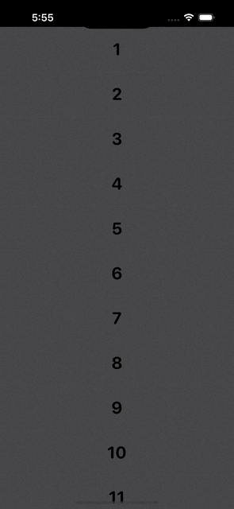

<a href="https://www.simform.com/"></a>

# SSSwiper

[](https://cocoapods.org/pods/SSStepper)
[](https://cocoapods.org/pods/SSStepper)
[![Swift Version][swift-image]][swift-url]
[![PRs Welcome][PR-image]][PR-url]
[](https://twitter.com/simform)

SSSwiper is used to create swipe gestures action inside any view just by adding a modifier to the View with various customization options.

 |  |  | <br/>
*An example of Swipers created with this library*

### About SSSwiper
This library is used to add multiple action buttons just by adding a modifier to the view with full flexibilites and customizastion. You can add swiping gestures and allow action in both horizontal sides and you can add items according to your choice on both sides. This library also supports destructive action which supports action if user swipes full and it will trigger the first option from the edge of the device. SSSwiper also gives to option to customize shape and spacing of the SwipeItems(Action Buttons). This library also has haptic feedbacks while performing diffrent operations. You can add as much as SwipeItems(Action Buttons) in SSSwiper as this supports responsive design which does not breaks your UI and it will adjust automaticaally by removing extra buttons according to device size. 

## Example

To run the example project, clone the repo, and run `pod install` from the Example directory first.

## Requirements

This pod requires a deployment target of iOS 14.0 or greater

## Installation

### Cocoapods

SSSwiper is available through [CocoaPods](https://cocoapods.org). <br/>To install
it, simply add the following line to your Podfile:

```ruby
pod 'SSSwiper'
```
and run `pod install` from the root directory of project and in your code add `import SSStepper` and boom you're done.💥

### Swift Package Manager

When using Xcode 11 or later, you can install `SSSwiper` through [Swift Package Manager](https://swift.org/package-manager/) by going to your Project settings > `Swift Packages` and add the repository by providing the GitHub URL. Alternatively, you can go to `File` > `Swift Packages` > `Add Package Dependencies...`

### Manually

1. Add `SwipeToActionModifier.swift`, `SwipeItems.swift` and `ExtensionView.swift` from `Sources` directory to your project.
2. Grab yourself a cold 🍺.

## Usage

Import the package in the file you would like to use it: 

```swift
import SSSwiper
```

This library shares one modifier which you can use to add functionality of swiping gesture. You also need to create one array of SwipeItems(Action Buttons) which take AnyView as your button design and pass that to the modifier.
Basic example:

```swift
@State var swipedChannelId: String?
let width = UIScreen.main.bounds.size.width
let swiperItems = [
            SwipeItems(
                buttonView: {
                            Image(systemName: "trash.fill")
                                .resizable()
                                .foregroundColor(.white)
                                .frame(width: 20, height: 20)
                                .castToAnyView
                } ,
                backgroundColor: .red,
                iconWidth: 20,
                onClicked: {
                        self.values.remove(at: values.firstIndex(of: number) ?? -1)
                }
            ),
            SwipeItems(
                buttonView: Text("Edit").foregroundColor(.white).castToAnyView ,
                backgroundColor: .purple,
                iconWidth: 20,
                onClicked: {
                        self.values.remove(at: values.firstIndex(of: number) ?? -1)
                }
            )
        ]
...
var body: some Scene {
    VStack {
        ForEach((1...10), id: \.self) {
            Text("\($0)…")
                .foregroundColor(.black)
                .font(.system(
                            size: 28, 
                            weight: .bold, 
                            design: .rounded
                            ))
                .frame(
                    width: width, 
                    height: 75
                    )
                .swipe(
                    itemWidth: width, 
                    trailingItems: swiperItems,
                    leadingItems: swiperItems, 
                    swipedChannelId: $swipedChannelId
                )
        }
    }
}
```

This example will add two Action items declared in swiperItems array to both side of edges.

Customizations
===

You can customize almost every main thing in This library.
For Customizations you have to pass optional agruments which you have to pass only if you want to change that value So, you need to add only those arguments which you wanted to customize. Here's the examples :

Change in Size (buttonWidth and buttonHeight)
-----

```swift
    VStack {
        ForEach((1...10), id: \.self) {
            Text("\($0)…")
                .foregroundColor(.black)
                .font(.system(
                            size: 28, 
                            weight: .bold, 
                            design: .rounded
                            ))
                .frame(
                    width: width, 
                    height: 75
                    )
                .swipe(
                    itemWidth: width, 
                    buttonWidth: 100,
                    buttonHeight: 100,
                    trailingItems: swiperItems,
                    leadingItems: swiperItems, 
                    swipedChannelId: $swipedChannelId
                )
        }
    }
```
This will change the height and width of the button to 100. Both of this field are optional and default value for this fields are 70. 

Change in Shapes (buttonStyle)
-----

```swift
    VStack {
        ForEach((1...10), id: \.self) {
            Text("\($0)…")
                .foregroundColor(.black)
                .font(.system(
                            size: 28, 
                            weight: .bold, 
                            design: .rounded
                            ))
                .frame(
                    width: width, 
                    height: 75
                    )
                .swipe(
                    itemWidth: width, 
                    trailingItems: swiperItems,
                    leadingItems: swiperItems, 
                    buttonStyle: .rounded(cornerRadius: 20),
                    swipedChannelId: $swipedChannelId
                )
        }
    }
```

By passing this optional argument you will be able to change the shape of SwipeItems(Action Buttons). You have three options for shapes like Circle, Rounded rectangle and simple Rectangle here which is value of enum. By default this value is set to Rectangle.

Change in spacing (spacing)
-----

```swift
    VStack {
        ForEach((1...10), id: \.self) {
            Text("\($0)…")
                .foregroundColor(.black)
                .font(.system(
                            size: 28, 
                            weight: .bold, 
                            design: .rounded
                            ))
                .frame(
                    width: width, 
                    height: 75
                    )
                .swipe(
                    itemWidth: width, 
                    trailingItems: swiperItems,
                    leadingItems: swiperItems, 
                    spacing: 2,
                    swipedChannelId: $swipedChannelId
                )
        }
    }
```

By passing this optional argument you will be able to change the spacing between the action buttons. You have to pass value of CGFloat. By default this value is set to 0.

Change in Destructive mode (allowLeadingDestructiveAction and allowTrailingDestructiveAction)
----

```swift
    VStack {
        ForEach((1...10), id: \.self) {
            Text("\($0)…")
                .foregroundColor(.black)
                .font(.system(
                            size: 28, 
                            weight: .bold, 
                            design: .rounded
                            ))
                .frame(
                    width: width, 
                    height: 75
                    )
                .swipe(
                    itemWidth: width, 
                    trailingItems: swiperItems,
                    leadingItems: swiperItems, 
                    allowLeadingDestructiveAction: false,
                    allowTrailingDestructiveAction: true,
                    swipedChannelId: $swipedChannelId
                )
        }
    }
```

By passing this optional arguments you will be able to Enable/Disable the destuctive mode for action on full swipe for either of the sides. You have to pass value of bool. By default this value is set to true for both of the sides.

**Up for a suggestions. Give suggestions for more features and customisations.**

## 🤝 How to Contribute

Whether you're helping us fix bugs, improve the docs, or a feature request, we'd love to have you! :muscle:

Check out our [**Contributing Guide**](CONTRIBUTING.md) for ideas on contributing.

## Find this example useful? ❤️

Give a ⭐️ if this project helped you!

## Check out our other Libraries

<h3><a href="https://github.com/SimformSolutionsPvtLtd/Awesome-Mobile-Libraries"><u>🗂 Simform Solutions Libraries→</u></a></h3>

## MIT License

This project is licensed under the MIT License - see the [LICENSE](LICENSE) file for details

[PR-image]:https://img.shields.io/badge/PRs-welcome-brightgreen.svg?style=flat
[PR-url]:http://makeapullrequest.com
[swift-image]:https://img.shields.io/badge/swift-5.0-orange.svg
[swift-url]: https://swift.org/
